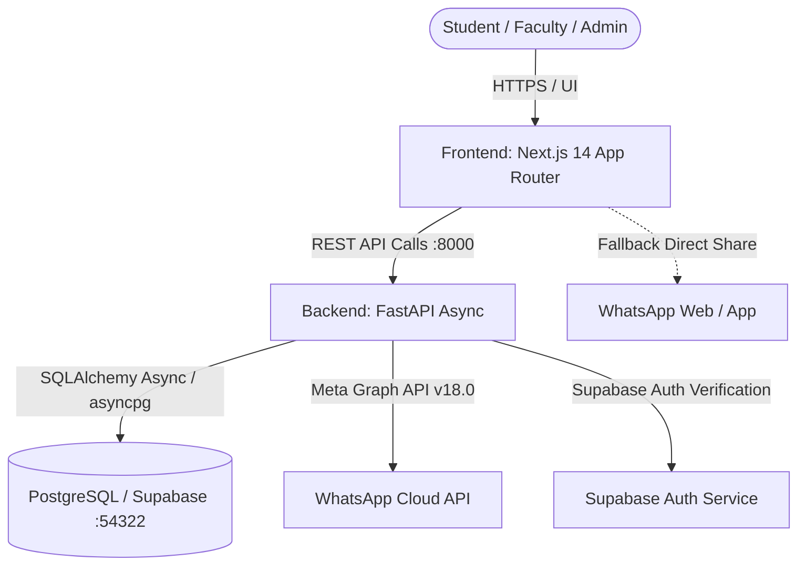

# DS-Connect — Full-Stack Architecture Guide

## 1. System Overview

**DS-Connect** is a specialized, production-ready portal for Data Science student cohorts, designed for real-time collaboration, placement tracking, hackathon discovery, project showcasing, and team roster management with WhatsApp community sharing.



---

## 2. Directory Separation

The repository strictly isolates presentation and client-side logic from server-side business rules and persistence layers:

```text
ds-connect/
├── frontend/                     # Next.js 14 App Router, TypeScript, Tailwind CSS
│   ├── src/
│   │   ├── app/                  # Application routes (pages, layouts)
│   │   │   ├── page.tsx          # Landing & highlights
│   │   │   ├── hackathons/       # Hackathon & opportunities directory
│   │   │   ├── placements/       # Placement drives & recruitment records
│   │   │   ├── projects/         # Project showcase & student submission
│   │   │   ├── members/          # Team cohort roster (Name, Year, Working Section)
│   │   │   ├── login/            # Authentication & role selector
│   │   │   ├── dashboard/        # Student personalized workspace
│   │   │   └── admin/            # Protected admin management suite
│   │   ├── components/           # Modular, reusable UI widgets & modals
│   │   │   ├── Navbar.tsx        # Responsive navigation & auth/theme controls
│   │   │   ├── ThemeToggle.tsx   # Dark/Light mode switch
│   │   │   ├── PlacementDetailsModal.tsx # Full-screen placement view
│   │   │   └── ...
│   │   ├── context/              # Global state providers
│   │   │   ├── AuthContext.tsx   # User session, role state & simulation
│   │   │   └── ThemeContext.tsx  # Dual theme (dark/light) persistence
│   │   ├── lib/                  # Client utility & API SDK
│   │   │   ├── api.ts            # Typed HTTP client communicating with backend
│   │   │   └── supabase.ts       # Supabase client SDK
│   │   └── types/                # Strict TypeScript contracts (api.d.ts)
│   ├── package.json
│   ├── tailwind.config.ts
│   └── tsconfig.json
│
├── backend/                      # Python 3.11+ FastAPI Server
│   ├── app/
│   │   ├── api/v1/               # Versioned REST API endpoints
│   │   │   ├── auth.py           # User profiles & role verification
│   │   │   ├── placements.py     # Placement CRUD & achievements
│   │   │   ├── hackathons.py     # Hackathon/opportunity CRUD
│   │   │   ├── projects.py       # Showcase submissions & admin approvals
│   │   │   ├── members.py        # Team members roster (Section 6 compliant)
│   │   │   ├── whatsapp.py       # WhatsApp Cloud API & broadcast formatting
│   │   │   └── router.py         # Master v1 API aggregator
│   │   ├── core/                 # App configuration & security dependencies
│   │   │   ├── config.py         # Pydantic v2 BaseSettings & environment loader
│   │   │   └── dependencies.py   # Auth & admin role dependency injection
│   │   ├── database/             # Database connection & engine setup
│   │   │   ├── session.py        # Async SQLAlchemy engine & session factory
│   │   │   └── supabase.py       # Supabase client & service role instance
│   │   ├── models/               # SQLAlchemy ORM declarative models
│   │   │   ├── placement.py
│   │   │   ├── opportunity.py
│   │   │   ├── project.py
│   │   │   └── user.py
│   │   ├── schemas/              # Pydantic validation & serialization schemas
│   │   │   ├── placement.py
│   │   │   ├── hackathon.py
│   │   │   ├── project.py
│   │   │   ├── member.py
│   │   │   └── whatsapp.py
│   │   ├── services/             # Pure business logic & 3rd-party integrations
│   │   │   ├── placement_service.py
│   │   │   ├── hackathon_service.py
│   │   │   ├── project_service.py
│   │   │   ├── member_service.py
│   │   │   └── whatsapp_service.py # WhatsApp Cloud API & fallback generator
│   │   └── main.py               # FastAPI application entrypoint & middleware
│   └── pyproject.toml / requirements.txt
│
├── docs/                         # Technical architecture, API, and DB documentation
│   ├── ARCHITECTURE.md
│   ├── API.md
│   └── DATABASE.md
│
├── supabase/                     # Database migrations, configuration & seed data
│   ├── migrations/
│   │   └── 20260905000001_initial_schema.sql
│   └── config.toml
│
├── docker-compose.yml            # Multi-container orchestration
└── README.md                     # Quickstart, setup, and developer guidelines
```

---

## 3. Data Flow & Communication

1. **Client Requests**: Next.js pages and components execute strongly-typed asynchronous fetches via `@/lib/api.ts` pointing to `NEXT_PUBLIC_API_URL` (default: `http://localhost:8000`).
2. **Backend Validation**: FastAPI routes validate payloads with Pydantic schemas, enforcing data types, default values, and range validations.
3. **Database Layer**: Services communicate with PostgreSQL via asynchronous SQLAlchemy sessions (`postgresql+asyncpg://`) with automated transaction management.
4. **WhatsApp Community Broadcasts**:
   - **Step 1**: The client or admin invokes `POST /api/v1/whatsapp/publish`.
   - **Step 2**: If `WHATSAPP_ACCESS_TOKEN` and `WHATSAPP_PHONE_NUMBER_ID` are configured in `.env`, the backend dispatches an official Meta Graph API request.
   - **Step 3**: If unconfigured or if the call fails, the backend seamlessly returns formatted broadcast text with a pre-filled `https://api.whatsapp.com/send?text=...` URL.
   - **Step 4**: The frontend copies the formatted message to the user clipboard and opens WhatsApp Web/Mobile in a single click.

---

## 4. Authentication & Authorization Flow

- **Dual Mode**:
  - In production, requests carry `Authorization: Bearer <supabase_jwt_token>`, verified by FastAPI using Supabase service keys.
  - In local development, the frontend `AuthContext` provides a simulated role switch (`student` / `admin`) that passes `X-User-Role` headers to enable immediate, frictionless testing of admin workflows.
- **Admin Endpoints**:
  - Endpoints such as `DELETE /api/v1/members/{id}`, `PUT /api/v1/projects/{id}/approve`, and `POST /api/v1/whatsapp/publish` are protected by `require_admin_user` FastAPI dependencies.\n