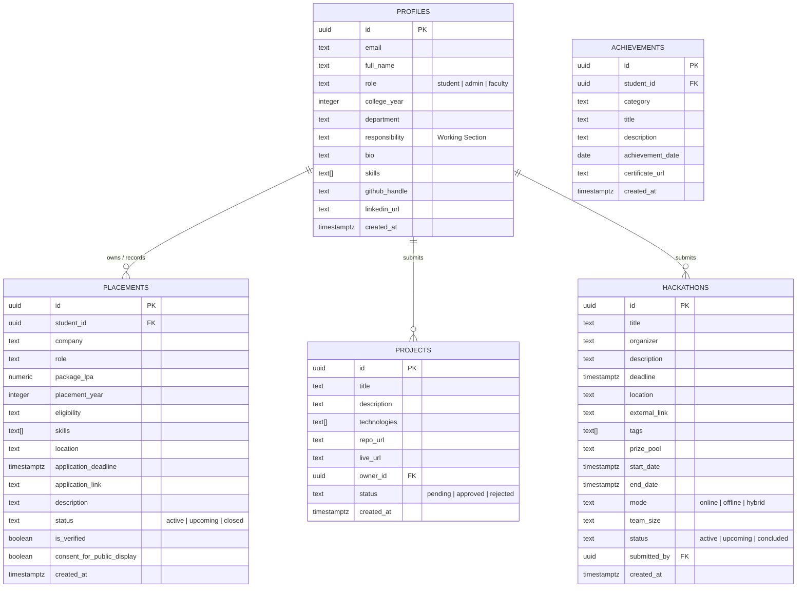

# DS-Connect — Database Schema & Architecture

The database runs on PostgreSQL 15 via Supabase, utilizing async connection pooling, UUID primary keys, and Row-Level Security (RLS).

---

## 1. Entity-Relationship Diagram

---

## 2. Table Specifications

### `public.profiles`
Represents users, cohort team members, faculty, and administrators.
* `id` (`uuid`, PK): Corresponds to Supabase Auth UID.
* `full_name` (`text`): Member's display name.
* `college_year` (`integer`): Academic year (1, 2, 3, 4).
* `responsibility` (`text`): The designated team/working section (e.g. *Data Science*, *Placement Coordinator*, *Web Infrastructure*).
* `role` (`text`): `student`, `admin`, or `faculty`.

### `public.placements`
Recruitment drives, company listings, and verified placement offers.
* `id` (`uuid`, PK)
* `company` (`text`): Hiring organization.
* `role` (`text`): Job designation.
* `package_lpa` (`numeric`): Compensation in Lakhs Per Annum.
* `eligibility` (`text`): Degree and CGPA criteria.
* `skills` (`text[]`): Required technical competencies.
* `location` (`text`): Job location / remote status.
* `application_deadline` (`timestamptz`): Last date to apply.
* `application_link` (`text`): Career portal URL.
* `description` (`text`): Drive details and selection process.
* `status` (`text`): `active`, `upcoming`, or `closed`.

### `public.opportunities` (Hackathons)
Hackathons, workshops, and competitive data science events.
* `id` (`uuid`, PK)
* `title` (`text`): Event name.
* `organizer` (`text`): Hosting university or platform.
* `deadline` (`timestamptz`): Registration cutoff.
* `prize_pool` (`text`): Cash rewards, prizes, or grants.
* `start_date` / `end_date` (`timestamptz`): Event schedule.
* `mode` (`text`): `online`, `offline`, or `hybrid`.
* `team_size` (`text`): Permitted team members (e.g., `1 - 4`).

### `public.projects`
Student projects with administrative approval pipeline.
* `id` (`uuid`, PK)
* `title` (`text`): Project title.
* `description` (`text`): Summary and architectural details.
* `technologies` (`text[]`): Tech stack tags.
* `repo_url` (`text`): GitHub / GitLab repository.
* `live_url` (`text`): Deployed web application or demo.
* `status` (`text`): `pending`, `approved`, or `rejected`. Default: `approved`.\n